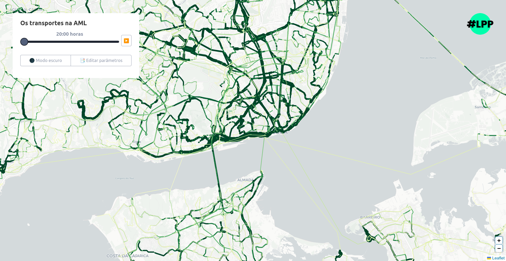

# Rede madrugada AML

Análise da oferta dos operadores de transporte público da AML com base na sua oferta planeada e divulgada através dos respetivos ficheiros GTFS.

## Interface web

https://lxparapessoas.github.io/rede-madrugada/

> Parâmetros suportados (adicionar ao URL, depois de ?, agregados por &):  
> Exemplo: https://lxparapessoas.github.io/rede-madrugada/?iframe=true&date=20250402&map=lines 
> - iframe=true, para esconder o formulário 
> - date=YYYYMMDD, para alterar a data dos dados 
> - map=parishes|lines, para alterar o tipo de mapa<br/

## Componentes

- [analysis.md](./analysis.md) Script de processamento dos GTFS e conversão para formado GeoJSON, para posterior visualização na interface *web*;
- [index.html](./index.html) A interface *web* de visualização da oferta de transportes.